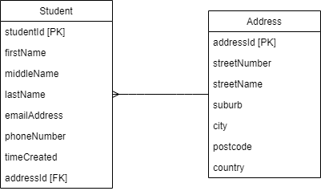

# StudentSIMS
A simple ASP.NET Core Web API that utilizes Azure services, for MSA 2020 backend part.

This Web API allows for modification and output of students' information from a hypothetical school database. It contains two tables: Student and Address. The two tables have a one-to-many relationship, explained why further on. The student table includes information like first name, last name, etc. The address table has information like street, postcode, etc. of the student. The website allows interaction with all of the API endpoints such as: GET, PUT, POST, DELETE requests. The following ER diagram represents the data structure:

A student can be added using the POST, edited with PUT, output with GET, and delete with DELETE. Similar actions are done with the addresses.
An address can be **added** to a student by adding a new address with POST:

Then editing the student's addressId property to match. Below we see John Cena's details changed to addressId = 6, which is our newly created address:

Similarly, lets say that John Cena has moved houses. We can then **change** his address details by just editing the initial address which was no. 6. Since John Cena already has his addressId set to 6, we only need to change that:

Here are our final tables:

As seen, the one-to-many relationship is supported by a foreign key in Student. This allows multiple students to have the same address, applicable for siblings or roommates. From the table, we have the Cena family(2) living in Onehunga and the Brown family(3) living in Greenlane. However, when a person moves addresses, care must be taken when interacting with the data as all the students currently living might have their address changed instead of only one.

This project uses Azure: SQL database, SQL server, web app.

[Swagger-UI](https://swagger.io/tools/swagger-ui/) is used for the deployed API UI.
